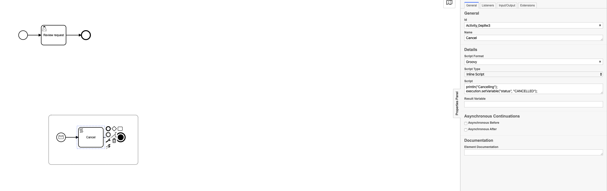
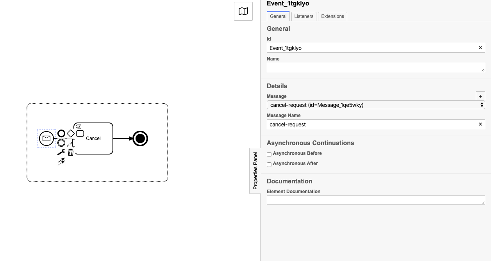

# Reference Data Service

Provides a UI for viewing and updating reference data. Data is not updated directly and requires an approval process.

# Server

The spring boot application provides a server to serve the client code but also 
acts as a reverse proxy removing the need to provide any additional configuration set up in the UI.

## Bootstrap configuration

The following environment variables are required to load properties from AWS Secrets manager

* AWS_SECRETS_MANAGER_ENABLED
* AWS_ACCESS_KEY
* AWS_SECRET_KEY
* AWS_REGION

### Application configuration

The following properties need to be configured in AWS secrets manager (example format provided)
```json
{
  "auth.url": "http://localhost:8080/auth",
  "auth.realm": "elf",
  "auth.clientId": "reference-data-service",
  "formApi.url": "http://localhost:4000",
  "refData.url": "http://localhost:3000",
  "workflowApi.url" : "http://localhost:8000",
  "serviceDesk.url": "service desk url",
  "uiEnvironment": "LOCAL",
  "uiVersion": "ALPHA",
  "server-port": 8004,
  "tracing.zipkin.baseUrl" : "http://localhost:9411",
  "tracing.enabled" : true,
  "newDataSetForm" : "newDataSetRequest",
  "newDataSetProcess" : "newDataSetRequest",
  "deleteDataSetProcess" : "deleteDataSetProcess",
  "addDataRowProcess" : "addDataRowProcess",
  "editDataRowProcess" : "editDataRowProcess",
  "deleteDataRowProcess" : "deleteDataRowProcess"
}
```

Start the server and it should start on port 8004

# Client

The client code is developed using the create-react-app module. Additional scripts added:

```json
"test-coverage" : "react-scripts test \"--coverage\" \"--watchAll=false\"",
"test-coverage-watch": "react-scripts test \"--coverage\" \"--watchAll=true\"",
"lint": "eslint --ignore-pattern node_modules/ --ext .js --ext .jsx --fix src"
```

To run the UI locally in hot deploy mode you will need to run

```bash
npm run start
```

***Please refer to the the sample.env when running in hot deploy mode.***

This will use the reverse proxy defined in the package.json.  


# Assemble

To produce the final artefact, run the following from the root of the project

```bash
./gradlew clean assemble
```

This will first clean and build the client code and then copy the build directory into the static directory of the server. Giving you a final output of
reference-data-service.jar which is a spring boot app.

You can then run the final output with

```bash
  SPRING_PROFILES_ACTIVE=local java -jar server/build/libs/reference-data-service.jar
```


# Workflow Guidelines

This reference data service requires the following variables:

* newDataSetProcess
* deleteDataSetProcess
* addDataRowProcess
* editDataRowProcess
* deleteDataRowProcess

These keys contain the values of the business process keys that can perform:

* Create a new data set
* Delete an existing data set
* Add a new data row
* Edit an existing data row
* Delete an existing data row


***Each of these BPMN should have a cancel event sub process with the message name "cancel-request". This allows each
business process how to handle the cancelling of a change request***

See below:





The business processes for each of these change requests should also have a status variable. This variable is created
when a request is submitted. It is the responsibility of the bpmn to update the status variable accordingly. The
statuses currently supported:

* SUBMITTED
* APPROVED
* REJECTED
* CANCELLED

And status that is not mappped will be marked with 'UNKNOWN'


# Form Guidelines

The following variable is request for creating a new data set:

* newDataSetForm

This defines the form name that will be presented to the user if they choose to create a new data set.
